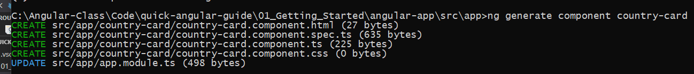
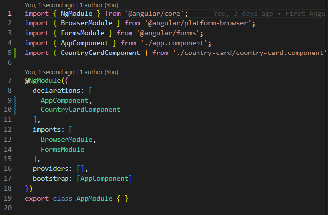

<div align="center">
  <h1>Angular Basics & Components</h1>
<sub>Author:
<a href="https://www.linkedin.com/in/bhuvanaganesan-l-2209047a" target="_blank">Bhuvan Ganesan</a><br>
</sub>
</div>

## Important Angular CLI command  

- **Schematics** commands: ng add,ng generate,ng new,ng update;
- **Architect** commands: ng build, ng deploy, ng e2e,ng lint,ng run,ng serve,ng test,ng - xi18n;
- and **Native** commands: ng config,ng doc,ng version, ng analytics, ng help.

## How Angular App gets Loaded and Started ?

Angular is a framework which allows us to create "Single Page Applications", and with the index.html is the single page which was provided by the server.

Now, you see how an "app-root" is included in index.html file. Now, let's see "How does Angular trigger?"

Whenever ng-serve builds the application, it creates "bundles" and automatically adds these to index.html file at runtime. So, from these bundles, the first code has to be executed from "main.ts" file, i.e., "main.ts" file is the main file from where the execution of an Angular application starts.

Here, the bootstrap method starts the Angular application. It refers to AppModule, which looks into the app folders. You can see in the "app.module" file that a bootstrap array which is basically a list of all the components analyzes the index.html file.

```sh
main.ts  >>   app.Module.ts  >>  app.component.ts  >>  index.html  >>  app.component.html  
```

**Angular in the end is a Javascript Framework, changing you DOM i.e HTML at runtime**

# Components

Components define views, which are sets of screen elements that Angular can choose among and modify according to your program logic and data. Components use services, which provide specific functionality not directly related to views. Service providers can be injected into components as dependencies, making your code modular, reusable, and efficient.

## How to create a Component

Generally, an interactive web page is made of HTML, CSS, and JavaScript. Angular component is no different.
**Angular Component** = HTML Template + Component Class + Component Metadata

### HTML Template
HTML template is nothing but a regular HTML code with additional Angular specific syntax to communicate with the component class.

### Class
Essentially, a component class is a TypeScript class that includes properties and methods. Properties store data and methods include the logic for the component. Eventually, this class will be compiled into JavaScript.

### Metadata
Metadata is some extra data for a component used by Angular API to execute the component, such as the location of HTML and CSS files of the component, selector, providers, etc.

To create via CLI

```sh
ng generate component <component name>
```


Below folder and files are created by the cmd


It update app.module file with imports array with new created component



 app.module class


```sh
import { Component } from '@angular/core';<----- Import
/*Metadata*/
@Component({
  selector: 'app-country-card',<----- Component tag
  templateUrl: './country-card.component.html', <----- Html file & path
  styleUrls: ['./country-card.component.css'] <----- CSS file & path
})
/*Component Class*/
export class CountryCardComponent {

}
```